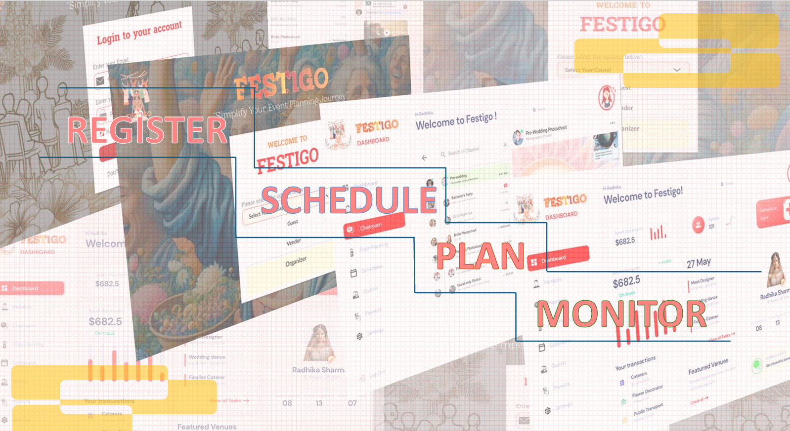
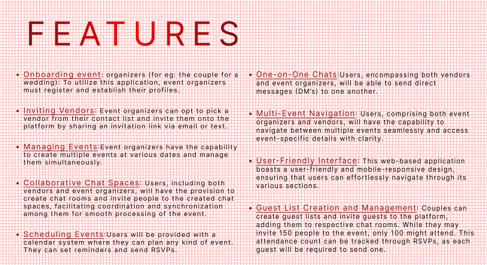

# Sample Festigo: Event Management Website <TS/NextJS>

<h2 align="center">FESTIGO</h2>
<h3 align="center">"Simplify your event planning journey!!!"</h3>


Festigo is an event planning and event organizing website that bring guests, vendors and event organizers(the people hosting the event) under a single umbrella. Apart from organizing different types of events, from birthdays to giveaways and beyond, our platform also streamlines the planning and coordination process for various events. With vendor management capabilities, vendors can efficiently handle multiple events across different dates simultaneously. Moreover, our platform empowers event organizers to manage multiple events concurrently, eliminating the need for them to juggle communication between various vendors.

---

## 🚀 Getting Started  

### Open Using Daytona  

1. **Install Daytona**: Follow the [Daytona installation guide](https://www.daytona.io/docs/installation/installation/).  
2. **Create the Workspace**:  
   ```bash  
   daytona create https://github.com/daytonaio/sample-nextjs-event-planner 
   ```  

4. **Start the Application**:  
   ```bash  
   cd festigo && npm run dev
   ```  

---

## ✨ Features



<br>

> [!IMPORTANT]
> **Figma link**: https://www.figma.com/design/6nLRk40BpOgl4lNwFqCQTe/Event-Website?node-id=1131-5516&node-type=canvas&t=PReSdHxXC6gDAf1S-0

> [!TIP]
> **Detailed Figma Explanation**: https://www.youtube.com/watch?v=Paq7I1Ru22s
